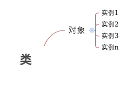

#javascript-oo概论#

###一.类，对象和实例###

关于类的说明:

类（class）是一种面向对象计算机编程语言的构造，是创建对象的蓝图，描述了所创建的对象共同的属性和方法。


关于对象的说明：

对象是面向对象（Object Oriented）中的术语，既表示客观世界问题空间（Namespace）中的某个具体的事物，又表示软件系统解空间中的基本元素。

在软件系统中，对象具有唯一的标识符，对象包括属性（Properties）和方法（Methods），属性就是需要记忆的信息，方法就是对象能够提供的服具有普务。在面向对象（Object Oriented）的软件中，对象（Object）是某一个类（Class）的实例（Instance）。

关于实例的说明：

对象代表了类的一个特定的实例。对象具有身份（identity）和属性值（attribute values）2个特征。实例是对象的具体表示，操作可以作用于实例，实例可以有状态地存储操作结果。实例被用来模拟现实世界中存在的、具体的或原型的东西。

对象就是类的实例，所有的对象都是实例，但并不是所有的实例都是对象。

三者用来比喻的关系：

我们可以说“人”是一个类，是一个抽象概念，比如有男人女人等等的一个通称的概念称之为类。

同时“一群人”的就区别了与”人“的关系，是有具体数量的，但是也是一个在小范围宏观的抽象概念，我们把通称为”一群人“这样的概念，理解成”对象”。

在将“一群人”进行细分之后得到一个具体的”王XX，李XX“，这样具有独特身份（identity）的每一个人称之为“实例”。这便是用形象的比喻来理解类和对象和实例之间关系的方法。

####有关于类，对象，实例关系的学习导图####



###二.JS中如何定义CLASS###

关于如何在JS中定义类（CALSS）的方法，可以参见如下代码：

```
function person(name,age,sex){
  this.name = name;
  this.age = age;
  this.sex = sex;
}

```
由以上代码我们可以看出，我们利用js的函数定义了一个称之为person的类，其中有name，age，sex等信息。

###三.在JS中如何定义属性，方法（类方法，实例方法）###

####在JS中定义属性###

我们可以参考定义类时所用的代码（详情参见上图），其中this.的语句代表了定义的方法，
我们通过了
```
this.name = name;
this.age = age;
this.sex = sex;
```
给person这样的类定义了三个称之为name，age，sex的属性。

####
